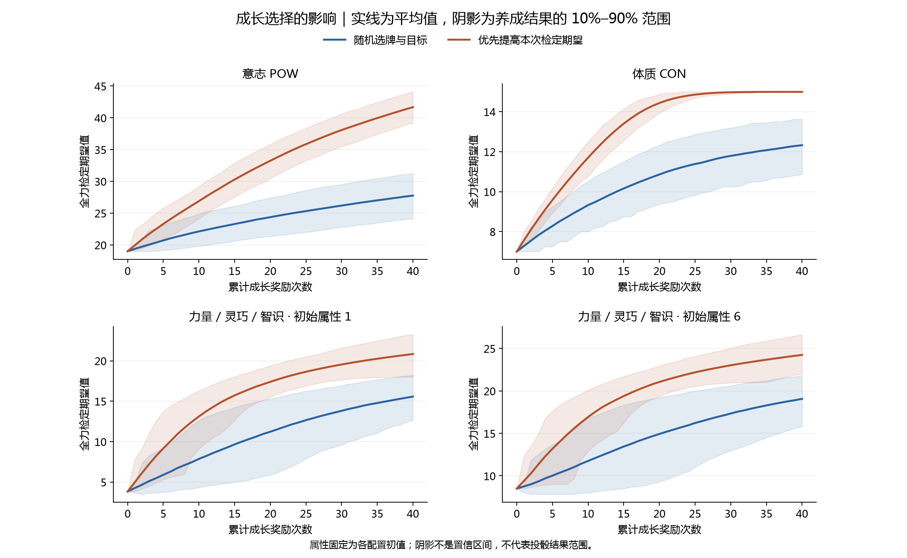
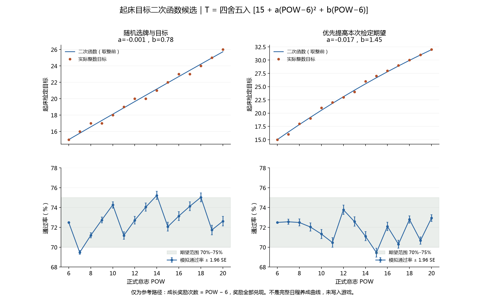

# 骰子成长模拟结果

此目录保留旧规则、奖励次数横轴的结果。当前参考已更新为[按正式属性值模拟](../dice-growth-attribute-20260920/README.md)，包含手册规则修复后的重跑数据。

本报告比较两种成长奖励选择方式：随机选择，以及优先提高本次全力检定期望。结果来自现有程序的抽卡和结算函数，不改变游戏规则。

## 模拟范围

- 随机种子：20260920；每配置每策略 2,000 条独立成长路径，每条结算 40 次奖励。
- 配置：意志、体质，以及力量/灵巧/智识的初始分配 1～6。后三项使用相同规则，因此复用同一组分配结果，不重复模拟。
- 稳定心情，无疲劳、负面附魔或精力限制。每次检定选择实际投掷期望最高的最多三颗骰；迅捷按两次取高计算。
- 随机策略：三张卡位等概率选择；需要指定骰子或骰面时，也均匀随机选择。
- 期望优先策略：根据已知卡面，精确计算本次奖励后最佳三骰的期望；随机目标按所有可能结果平均，不偷看结算结果。同分取最先列出的选择。它不是长期最优或通过率最优策略。
- 两策略使用相同初始骰面种子，后续各自独立的随机流；不强行让已经分叉的奖励池抽到相同卡。
- 只模拟成长奖励，不模拟日程出现频率、退化、睡眠疲劳或迷雾。当前成长界面没有调用迷雾结算。
- 每个骰池的投掷概率由精确卷积获得；抽样误差只来自成长路径，不来自重复投骰。

## 期望对比

下表包含固定初始属性的 50% 修正；奖励次数与正式属性是独立维度。

| 配置 | 策略 | 初始 | 10 次 | 20 次 | 40 次 | 无变化奖励比例 |
|---|---|---:|---:|---:|---:|---:|
| 意志 POW | 随机选牌与目标 | 19.00 | 22.12 | 24.37 | 27.76 | 3.2% |
| 意志 POW | 优先提高本次检定期望 | 19.00 | 26.89 | 33.24 | 41.68 | 1.5% |
| 体质 CON | 随机选牌与目标 | 7.00 | 9.32 | 10.86 | 12.32 | 26.0% |
| 体质 CON | 优先提高本次检定期望 | 7.00 | 11.70 | 14.43 | 14.99 | 41.2% |
| 力量 / 灵巧 / 智识 · 初始属性 1 | 随机选牌与目标 | 3.83 | 7.87 | 11.22 | 15.57 | 11.5% |
| 力量 / 灵巧 / 智识 · 初始属性 1 | 优先提高本次检定期望 | 3.83 | 13.12 | 17.39 | 20.83 | 14.1% |
| 力量 / 灵巧 / 智识 · 初始属性 2 | 随机选牌与目标 | 5.17 | 8.96 | 12.40 | 16.71 | 11.9% |
| 力量 / 灵巧 / 智识 · 初始属性 2 | 优先提高本次检定期望 | 5.17 | 14.15 | 18.47 | 21.83 | 14.7% |
| 力量 / 灵巧 / 智识 · 初始属性 3 | 随机选牌与目标 | 5.50 | 9.11 | 12.50 | 16.68 | 12.5% |
| 力量 / 灵巧 / 智识 · 初始属性 3 | 优先提高本次检定期望 | 5.50 | 14.45 | 18.66 | 21.93 | 15.5% |
| 力量 / 灵巧 / 智识 · 初始属性 4 | 随机选牌与目标 | 6.83 | 10.34 | 13.64 | 17.83 | 13.4% |
| 力量 / 灵巧 / 智识 · 初始属性 4 | 优先提高本次检定期望 | 6.83 | 15.68 | 19.74 | 23.03 | 15.9% |
| 力量 / 灵巧 / 智识 · 初始属性 5 | 随机选牌与目标 | 7.17 | 10.63 | 13.82 | 17.97 | 14.3% |
| 力量 / 灵巧 / 智识 · 初始属性 5 | 优先提高本次检定期望 | 7.17 | 15.75 | 19.84 | 23.02 | 16.6% |
| 力量 / 灵巧 / 智识 · 初始属性 6 | 随机选牌与目标 | 8.50 | 11.75 | 14.93 | 19.07 | 15.1% |
| 力量 / 灵巧 / 智识 · 初始属性 6 | 优先提高本次检定期望 | 8.50 | 16.93 | 21.06 | 24.25 | 16.9% |



阴影为不同成长路径中“检定期望”的第 10～90 百分位，不是投骰结果区间，也不是平均值的置信区间。

## 通过率曲线与数据库口径

每条曲线取满足 P(最终结果 ≥ 目标) 不低于指定通过率的最高整数目标。因此实际通过率可能高于标签；整数骰值不一定能精确实现 20%、30% 等概率。数据库同时保留该目标、实际概率、目标再加 1 的概率以及 Monte Carlo 标准误。
以随机养成路径等权混合计算曲线，不能据此保证每一个具体骰组都达到标注概率。期望优先也可能降低某些阈值的通过率。

- [意志 POW的两策略曲线](pow-curves.png)
- [体质 CON的两策略曲线](con-curves.png)
- [力量 / 灵巧 / 智识 · 初始属性 1的两策略曲线](allocated_1-curves.png)
- [力量 / 灵巧 / 智识 · 初始属性 2的两策略曲线](allocated_2-curves.png)
- [力量 / 灵巧 / 智识 · 初始属性 3的两策略曲线](allocated_3-curves.png)
- [力量 / 灵巧 / 智识 · 初始属性 4的两策略曲线](allocated_4-curves.png)
- [力量 / 灵巧 / 智识 · 初始属性 5的两策略曲线](allocated_5-curves.png)
- [力量 / 灵巧 / 智识 · 初始属性 6的两策略曲线](allocated_6-curves.png)

数据库：`dice-growth.sqlite`；可读数值导出：`summary.json`。

- `growth`：按配置、策略、奖励次数保存骰子期望与养成离散程度。
- `distribution`：0～60 原始骰点的完整混合概率、尾概率及尾概率标准误。
- `target_curve`：20%～80% 的原始整数阈值。
- `lookup`：加入正式属性 0～40 的修正后目标；当前属性超过 20 时，修正仍按 20 计算。
- `expected_value`：加入属性修正的检定期望。
- `metadata`：种子、模型范围、统计方法和局限。

查询示例：意志 10、已结算 12 次成长奖励，选择期望优先，目标通过率不低于 70%。

```sql
SELECT target, actual_probability, probability_at_next_target, pass_mc_se
FROM lookup WHERE scenario='pow' AND policy='greedy'
AND formal_attribute=10 AND reward_count=12 AND requested_probability=0.7;
```

对 `distribution` 可计算任意已有目标的通过率：先减去属性修正，再查询对应 `raw_score` 的 `pass_probability`。95% 抽样区间可近似取概率 ± 1.96×标准误；这只反映成长抽样精度，不反映规则遗漏或未来改版误差。

## 起床检定二次函数候选

初始意志 6、两枚初始骰全部投入、目标 15，通过率精确为 72.5%，结果期望为 19。两策略在未发生任何成长时完全一致。

正式意志不能唯一决定骰组：属性加成、加值、日程等也会触发奖励。以下候选只采用明确可复现的参考路径——每增加 1 点正式意志，兑现 1 次成长奖励，即 k = POW − 6。不能把它当作所有玩家的平均成长。

拟合区间 POW 6～20；令 z = POW − 6。下列公式按 floor(值 + 0.5) 四舍五入，锚定目标 15，并在此区间内单调不减。以逐级通过率接近 72.5% 为目标搜索简短系数。未修改现有程序的固定目标 15。

### 随机选牌与目标

T = floor(15 + (-0.001) × z² + 0.78 × z + 0.5)

整数目标对应通过率范围：69.47%～75.23%。
超出 70%～75% 的意志档位：7、14、18。
连任意整数目标都无法落在 70%～75% 的档位：无。

| 意志 | 成长奖励 | 目标 | 通过率 | 约 95% 抽样误差 |
|---:|---:|---:|---:|---:|
| 6 | 0 | 15 | 72.50% | ±0.00% |
| 7 | 1 | 16 | 69.47% | ±0.20% |
| 8 | 2 | 17 | 71.19% | ±0.26% |
| 9 | 3 | 17 | 72.75% | ±0.30% |
| 10 | 4 | 18 | 74.27% | ±0.32% |
| 11 | 5 | 19 | 71.18% | ±0.38% |
| 12 | 6 | 20 | 72.72% | ±0.39% |
| 13 | 7 | 20 | 74.05% | ±0.41% |
| 14 | 8 | 21 | 75.23% | ±0.41% |
| 15 | 9 | 22 | 72.07% | ±0.44% |
| 16 | 10 | 23 | 73.15% | ±0.45% |
| 17 | 11 | 23 | 74.13% | ±0.45% |
| 18 | 12 | 24 | 75.03% | ±0.45% |
| 19 | 13 | 25 | 71.74% | ±0.48% |
| 20 | 14 | 26 | 72.62% | ±0.48% |

### 优先提高本次检定期望

T = floor(15 + (-0.017) × z² + 1.45 × z + 0.5)

整数目标对应通过率范围：69.45%～73.78%。
超出 70%～75% 的意志档位：15。
连任意整数目标都无法落在 70%～75% 的档位：无。

| 意志 | 成长奖励 | 目标 | 通过率 | 约 95% 抽样误差 |
|---:|---:|---:|---:|---:|
| 6 | 0 | 15 | 72.50% | ±0.00% |
| 7 | 1 | 16 | 72.56% | ±0.26% |
| 8 | 2 | 18 | 72.49% | ±0.36% |
| 9 | 3 | 19 | 72.04% | ±0.42% |
| 10 | 4 | 21 | 71.33% | ±0.46% |
| 11 | 5 | 22 | 70.47% | ±0.48% |
| 12 | 6 | 23 | 73.78% | ±0.47% |
| 13 | 7 | 24 | 72.58% | ±0.47% |
| 14 | 8 | 26 | 71.10% | ±0.46% |
| 15 | 9 | 27 | 69.45% | ±0.45% |
| 16 | 10 | 28 | 72.10% | ±0.42% |
| 17 | 11 | 29 | 70.30% | ±0.40% |
| 18 | 12 | 30 | 72.80% | ±0.37% |
| 19 | 13 | 31 | 70.67% | ±0.36% |
| 20 | 14 | 32 | 72.94% | ±0.34% |



## 现程序的已知局限

- 面值达到上限后仍可能被选作强化目标，奖励消耗但没有变化；本轮未改这条程序行为。
- 替换骰面的新值按当前骰池最大骰型生成，再按目标骰型截断；它不完全等同于手册的“按目标骰型生成”。
- 随机策略中的无变化还包括替换为原值等正常情况，因此表中的无变化比例不全是上述边界问题。
- 贪心会回避即时收益低的奖励，包括可能在以后才有价值的新骰或骰型升级；不能据此认定这些奖励设计无价值。
- 这里没有采用现有训练难度函数推导成长频率，也没有模拟完整日程循环。二次函数的适用性取决于以后确认的参考成长路径。
- 若要修正奖励规则，需重新运行模拟；不要把这一版数据标为修正规则后的结果。

## 复现

程序：`tools/simulate_dice_growth.py`；绘图：`tools/plot_dice_growth.py`。依赖 NumPy，绘图额外依赖 Matplotlib。

```text
python tools/simulate_dice_growth.py --trials 2000 --rewards 40 --seed 20260920 --output <新的结果目录>
python tools/plot_dice_growth.py <结果目录>
```

初始概率、迅捷精确分布、选牌评分、随机目标平均、种子复现、阈值顺序和长期骰型/数量限制均有可运行单元测试。
