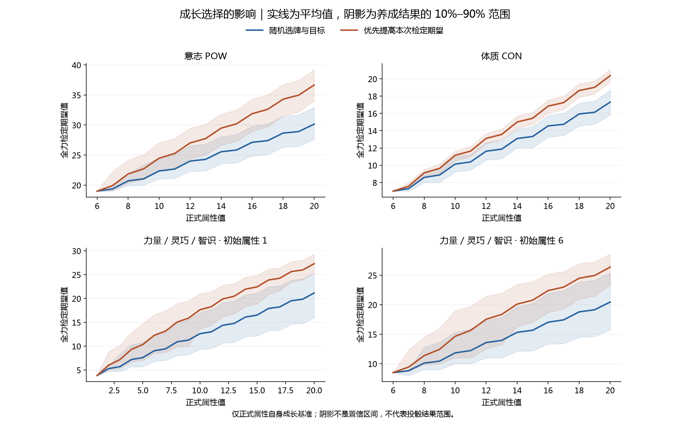
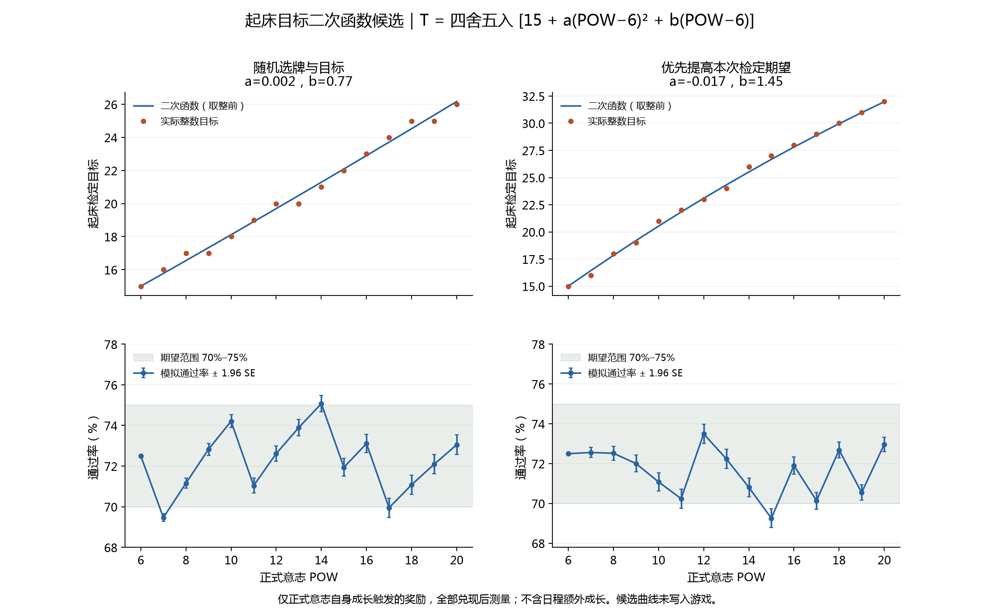

# 按正式属性值模拟骰子成长

后续完整训练链模拟见 [完整训练成长第一版](../dice-growth-training-20260920/README.md)。本页保留为“仅正式属性奖励”的历史对比，不代表完整养成结果。

横轴为正式属性值，比较随机选择与优先提高本次全力检定期望两种策略。本版已修正满面值强化和替换骰面规则，并重新运行模拟；旧版奖励次数曲线不再用于本版平衡参考。

## 模拟范围

- 随机种子：20260920；每配置每策略 2,000 条独立成长路径，从该配置初始属性成长至 20。
- 配置：意志、体质，以及力量/灵巧/智识的初始分配 1～6。后三项使用相同规则，因此复用同一组分配结果，不重复模拟。
- 稳定心情，无疲劳、负面附魔或精力限制。每次检定选择实际投掷期望最高的最多三颗骰；迅捷按两次取高计算。
- 随机策略：三张卡位等概率选择；需要指定骰子或骰面时，也均匀随机选择。
- 期望优先策略：根据已知卡面，精确计算本次奖励后最佳三骰的期望；随机目标按所有可能结果平均，不偷看结算结果。同分取最先列出的选择。它不是长期最优或通过率最优策略。
- 两策略使用相同初始骰面种子，后续各自独立的随机流；不强行让已经分叉的奖励池抽到相同卡。
- 成长口径：只计算正式属性自身增长。每增加 1 点正式属性，调用实际属性成长计数器、小休进度转换、待领奖励抽取与结算；奖励兑现后记录该属性点的数据。
- 不包含属性加成、属性加值、日程和事件额外奖励，也不模拟退化、睡眠疲劳或迷雾。因此这是统一参考路径，不是完整日程养成的平均结果。
- 每个骰池的投掷概率由精确卷积获得；抽样误差只来自成长路径，不来自重复投骰。

## 期望对比

下表包含各属性点的 floor(min(属性, 20) × 0.5) 修正。不同初始分配分别保留，不能把相同最终属性但不同初始骰面的路径混为一条曲线。

| 配置 | 策略 | 初始 | 属性 10 | 属性 15 | 属性 20 | 无变化奖励比例 |
|---|---|---:|---:|---:|---:|---:|
| 意志 POW | 随机选牌与目标 | 19.00 | 22.35 | 25.84 | 30.15 | 1.4% |
| 意志 POW | 优先提高本次检定期望 | 19.00 | 24.48 | 30.20 | 36.66 | 0.5% |
| 体质 CON | 随机选牌与目标 | 7.00 | 10.13 | 13.33 | 17.31 | 8.7% |
| 体质 CON | 优先提高本次检定期望 | 7.00 | 11.15 | 15.44 | 20.37 | 2.2% |
| 力量 / 灵巧 / 智识 · 初始属性 1 | 随机选牌与目标 | 3.83 | 12.61 | 16.50 | 21.15 | 4.5% |
| 力量 / 灵巧 / 智识 · 初始属性 1 | 优先提高本次检定期望 | 3.83 | 17.63 | 22.43 | 27.29 | 2.2% |
| 力量 / 灵巧 / 智识 · 初始属性 2 | 随机选牌与目标 | 5.17 | 12.38 | 16.20 | 20.87 | 4.6% |
| 力量 / 灵巧 / 智识 · 初始属性 2 | 优先提高本次检定期望 | 5.17 | 16.93 | 22.07 | 27.10 | 2.1% |
| 力量 / 灵巧 / 智识 · 初始属性 3 | 随机选牌与目标 | 5.50 | 12.23 | 16.07 | 20.72 | 4.3% |
| 力量 / 灵巧 / 智识 · 初始属性 3 | 优先提高本次检定期望 | 5.50 | 16.55 | 21.89 | 27.02 | 2.1% |
| 力量 / 灵巧 / 智识 · 初始属性 4 | 随机选牌与目标 | 6.83 | 12.05 | 16.02 | 20.70 | 4.3% |
| 力量 / 灵巧 / 智识 · 初始属性 4 | 优先提高本次检定期望 | 6.83 | 15.83 | 21.56 | 26.83 | 2.1% |
| 力量 / 灵巧 / 智识 · 初始属性 5 | 随机选牌与目标 | 7.17 | 12.05 | 15.87 | 20.69 | 4.3% |
| 力量 / 灵巧 / 智识 · 初始属性 5 | 优先提高本次检定期望 | 7.17 | 15.15 | 21.18 | 26.64 | 2.2% |
| 力量 / 灵巧 / 智识 · 初始属性 6 | 随机选牌与目标 | 8.50 | 11.84 | 15.67 | 20.46 | 4.7% |
| 力量 / 灵巧 / 智识 · 初始属性 6 | 优先提高本次检定期望 | 8.50 | 14.64 | 20.77 | 26.39 | 2.4% |



阴影为不同成长路径中“检定期望”的第 10～90 百分位，不是投骰结果区间，也不是平均值的置信区间。

## 通过率曲线与数据库口径

每条曲线取满足 P(最终结果 ≥ 目标) 不低于指定通过率的最高整数目标。因此实际通过率可能高于标签；整数骰值不一定能精确实现 20%、30% 等概率。数据库同时保留该目标、实际概率、目标再加 1 的概率以及 Monte Carlo 标准误。
以随机养成路径等权混合计算曲线，不能据此保证每一个具体骰组都达到标注概率。期望优先也可能降低某些阈值的通过率。

- [意志 POW的两策略曲线](pow-curves.png)
- [体质 CON的两策略曲线](con-curves.png)
- [力量 / 灵巧 / 智识 · 初始属性 1的两策略曲线](allocated_1-curves.png)
- [力量 / 灵巧 / 智识 · 初始属性 2的两策略曲线](allocated_2-curves.png)
- [力量 / 灵巧 / 智识 · 初始属性 3的两策略曲线](allocated_3-curves.png)
- [力量 / 灵巧 / 智识 · 初始属性 4的两策略曲线](allocated_4-curves.png)
- [力量 / 灵巧 / 智识 · 初始属性 5的两策略曲线](allocated_5-curves.png)
- [力量 / 灵巧 / 智识 · 初始属性 6的两策略曲线](allocated_6-curves.png)

数据库：`dice-growth.sqlite`；可读数值导出：`summary.json`。

- `growth`：按初始配置、策略、正式属性保存骰子期望、养成离散程度、当点修正和已结算奖励数。
- `distribution`：0～60 原始骰点的完整混合概率、尾概率及尾概率标准误。
- `target_curve`：20%～80% 的原始整数阈值。
- `lookup`：加入当点正式属性修正的目标；按实际模拟的属性点查询，不再把任意属性和任意奖励次数交叉组合。
- `expected_value`：加入属性修正的检定期望。
- `metadata`：种子、模型范围、统计方法和局限。

查询示例：正式意志 10，选择期望优先，目标通过率不低于 70%。

```sql
SELECT target, actual_probability, probability_at_next_target, pass_mc_se
FROM lookup WHERE scenario='pow' AND policy='greedy'
AND formal_attribute=10 AND requested_probability=0.7;
```

对 `distribution` 可计算任意已有目标的通过率：先减去属性修正，再查询对应 `raw_score` 的 `pass_probability`。95% 抽样区间可近似取概率 ± 1.96×标准误；这只反映成长抽样精度，不反映规则遗漏或未来改版误差。

## 起床检定二次函数候选

初始意志 6、两枚初始骰全部投入、目标 15，通过率精确为 72.5%，结果期望为 19。两策略在未发生任何成长时完全一致。

以下候选使用与主图一致的正式属性自身成长基准。其他成长来源会使同一意志值下的骰组不同，不能把这条参考路径当作所有玩家的平均成长。

拟合区间 POW 6～20；令 z = POW − 6。下列公式按 floor(值 + 0.5) 四舍五入，锚定目标 15，并在此区间内单调不减。以逐级通过率接近 72.5% 为目标搜索简短系数。未修改现有程序的固定目标 15。

### 随机选牌与目标

T = floor(15 + (0.002) × z² + 0.77 × z + 0.5)

整数目标对应通过率范围：69.47%～75.07%。
超出 70%～75% 的意志档位：7、14、17。
连任意整数目标都无法落在 70%～75% 的档位：无。

| 意志 | 成长奖励 | 目标 | 通过率 | 约 95% 抽样误差 |
|---:|---:|---:|---:|---:|
| 6 | 0 | 15 | 72.50% | ±0.00% |
| 7 | 1 | 16 | 69.47% | ±0.19% |
| 8 | 2 | 17 | 71.16% | ±0.25% |
| 9 | 3 | 17 | 72.83% | ±0.30% |
| 10 | 4 | 18 | 74.21% | ±0.32% |
| 11 | 5 | 19 | 71.04% | ±0.37% |
| 12 | 6 | 20 | 72.61% | ±0.39% |
| 13 | 7 | 20 | 73.90% | ±0.40% |
| 14 | 8 | 21 | 75.07% | ±0.40% |
| 15 | 9 | 22 | 71.94% | ±0.44% |
| 16 | 10 | 23 | 73.11% | ±0.45% |
| 17 | 11 | 24 | 69.95% | ±0.48% |
| 18 | 12 | 25 | 71.08% | ±0.47% |
| 19 | 13 | 25 | 72.09% | ±0.47% |
| 20 | 14 | 26 | 73.05% | ±0.48% |

### 优先提高本次检定期望

T = floor(15 + (-0.017) × z² + 1.45 × z + 0.5)

整数目标对应通过率范围：69.25%～73.49%。
超出 70%～75% 的意志档位：15。
连任意整数目标都无法落在 70%～75% 的档位：无。

| 意志 | 成长奖励 | 目标 | 通过率 | 约 95% 抽样误差 |
|---:|---:|---:|---:|---:|
| 6 | 0 | 15 | 72.50% | ±0.00% |
| 7 | 1 | 16 | 72.56% | ±0.25% |
| 8 | 2 | 18 | 72.52% | ±0.36% |
| 9 | 3 | 19 | 72.00% | ±0.42% |
| 10 | 4 | 21 | 71.08% | ±0.46% |
| 11 | 5 | 22 | 70.24% | ±0.49% |
| 12 | 6 | 23 | 73.49% | ±0.48% |
| 13 | 7 | 24 | 72.24% | ±0.48% |
| 14 | 8 | 26 | 70.81% | ±0.47% |
| 15 | 9 | 27 | 69.25% | ±0.46% |
| 16 | 10 | 28 | 71.91% | ±0.44% |
| 17 | 11 | 29 | 70.13% | ±0.42% |
| 18 | 12 | 30 | 72.68% | ±0.39% |
| 19 | 13 | 31 | 70.54% | ±0.38% |
| 20 | 14 | 32 | 72.97% | ±0.35% |



## 本版规则修正与边界

- 按手册 5.9：满面值不能作为强化目标；抽卡、选择列表和实际结算均排除。所有骰面均满时不抽强化卡；失效选择不消耗待领奖励。
- 替换值按目标骰型生成，不再用骰池最大骰型。低值段为 ceil(骰型 × 0.1) 至 floor(骰型 × 0.4)，例如 d20 为 2～8。
- 保留抽卡时预览数值：混合骰型卡分别显示各骰型的替换值，目标确定后采用对应值。同骰型共用该卡的一个面值；此预览方式是现有交互的延续，不是手册新增规则。
- 无变化奖励仍可能来自替换成原值等合法情况，不能把该比例等同于程序错误。
- 贪心会回避即时收益低的奖励，包括可能在以后才有价值的新骰或骰型升级；不能据此认定这些奖励设计无价值。
- 这里没有采用现有训练难度函数推导成长频率，也没有模拟完整日程循环。二次函数的适用性取决于以后确认的参考成长路径。
- 本次没有改变游戏里的检定难度或重写手册。

## 复现

程序：`tools/simulate_dice_growth.py`；绘图：`tools/plot_dice_growth.py`。依赖 NumPy，绘图额外依赖 Matplotlib。

```text
python tools/simulate_dice_growth.py --trials 2000 --max-attribute 20 --seed 20260920 --output <新的结果目录>
python tools/plot_dice_growth.py <结果目录>
```

初始概率、迅捷精确分布、选牌评分、随机目标平均、种子复现、阈值顺序和长期骰型/数量限制均有可运行单元测试。
