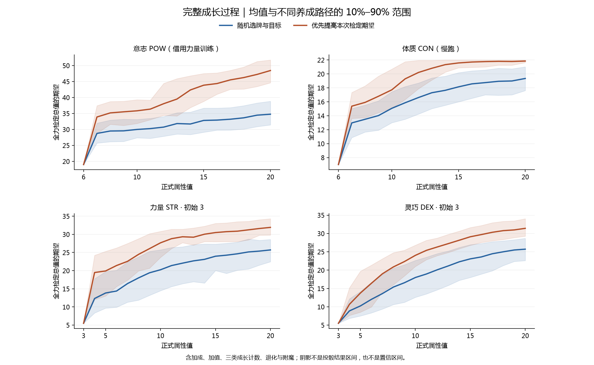
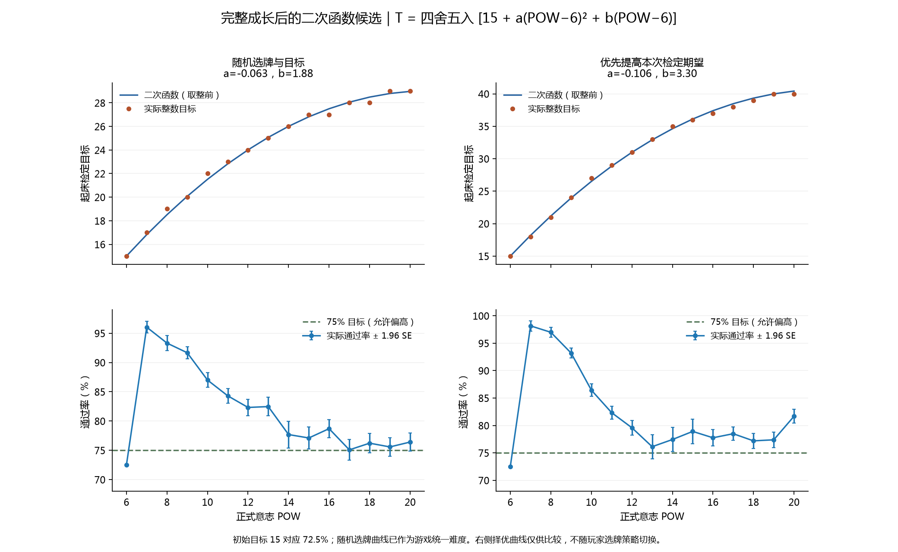

# 完整训练成长模拟 · 第一版

本版是指定训练安排下的完整成长链，不是整个剧情流程的玩家平均值。没有新增正式意志训练日程；2026年9月20日起床检定采用本版随机选牌拟合曲线作为统一基础难度。

## 意志结果速览

以下是每天集中培养的代理场景，不是普通剧情安排下的平均养成。成长奖励数量不再等于“正式意志 − 6”。

| 正式意志 | 随机：命中数 | 随机：已领奖励 | 随机：总值期望 | 随机：70%目标 | 期望优先：命中数 | 期望优先：已领奖励 | 期望优先：总值期望 | 期望优先：70%目标 |
|---:|---:|---:|---:|---:|---:|---:|---:|---:|
| 6 | 1000 | 0.0 | 19.00 | 15 | 1000 | 0.0 | 19.00 | 15 |
| 10 | 203 | 14.8 | 29.99 | 26 | 214 | 13.9 | 35.83 | 31 |
| 15 | 151 | 28.0 | 32.82 | 28 | 116 | 27.8 | 43.85 | 38 |
| 20 | 192 | 38.5 | 34.76 | 30 | 162 | 39.9 | 48.44 | 43 |

奖励数为命中路径的平均已领取数量；尚未兑换的成长进度另存数据库。开局目标15对应72.5%，而表中“70%目标”是至少70%通过率允许的最高整数目标，两者定义不同。

## 本版采用的条件

- 每个配置、每种策略 1,000 条独立路径；种子 20260920；最多模拟 730 天，正式属性到达或跨过 20 后结束。
- 每天六个普通行动轮集中培养目标属性；投入当前期望最高的合法最多三骰，精力不足或没有合法骰组时休息；每晚按时睡觉。休息实际投体质骰恢复精力，训练疲劳真实累积、休息减层、睡眠清空。
- 为隔离养成因素，全程固定心情平稳；不模拟训练成败带来的心情偏移。按时睡觉仍正常累积良好作息。测量通过率时不限精力，但成长过程按实际精力消耗。
- 意志借用力量的成功奖励概率、已有加成衰减和训练进度；骰子仍为意志 d20，最多三颗。力量使用原模型；灵巧只有训练进度转加成；体质使用慢跑，包含 CON/STR/DEX 混合选骰及多属性奖励，初始其他属性 STR3/DEX3/INT2。
- 力量和灵巧分别模拟初始 1～6。智识没有训练日程，本版不冒充已有智识全日程曲线；其骰子奖励规则仍与力量、灵巧同类。
- 随机策略：先均匀选卡位，再随机选合法目标。期望优先策略：根据已展示卡面，最大化结算后当次全力检定期望；随机效果按所有可能结果平均，不偷看随机结果。退化时同样尽量保留期望。不是长期最优或精力效率最优。

## 完整结算与程序差异

- 包含加成 → 每晚小休 → 加值 → 每周大休 → 正式属性。加成每累计获得 4 层、加值每累计获得 2 点、正式属性每增长 1 点，三个计数器分别累计骰子成长奖励。流失也按现有核心规则处理。
- 训练等级进度 0/1/2/3/6 封顶 6，满 6 在晚上转为一层属性加成，不是直接发一次骰子奖励；溢出不保留，沿用测试模型。慢跑不使用这条训练进度。
- 小休先兑换骰子成长进度，大休后产生的正式属性奖励要等下一晚小休才兑换，没有为了测量提前发奖。待选奖励先于退化卡结算，包含新骰、合法骰型变化、骰面变化、附魔、封印、束缚与解除负面附魔。
- 每周调用临时附魔衰退；本训练场景没有临时附魔来源，奖励卡提供的轻盈/轻捷是永久附魔，不能每周擅自删除。
- **程序连接已补齐：** 训练进度在实际睡眠的小休开始时转为加成；普通训练的大失败在心情变化前累计退化，待选惩罚在进入下一轮前处理。意志仍仅为离线训练代理，没有新增意志训练日程。原数据库保留生成时的说明，未重算或覆盖数值结果。
- 未配置的剧情事件奖励不虚构；迷雾未进入当前奖励 UI，因此不加入。按时睡觉的本场景不会产生熬夜疲劳或深度疲劳。

## 如何读图

- 横轴只用正式属性。每条路径只记录该值第一次实际出现的早晨，初始值记录开局。每周可能一次增加多个正式点，跳过的整数属性不补样本。
- 每点样本数可能小于总路径数；下方柱状图显示命中比例。曲线是“确实命中该值”的路径的条件分布，不能代表未命中或更晚停留在该值的角色。未到达上限的路径也保留在停止统计中。
- 每条样本使用当时完整属性：正式值 + 加值 + 加成，先封顶 20，再乘 50% 向下取整。分别计算总值分布后才混合，不能先平均属性修正再算概率。
- 封印骰不参与，束缚骰强制参与。全部封印时记为不可检定，所有目标均失败；分布表中概率质量之和等于可检定比例。若连最低目标也达不到指定通过率，目标留空。
- 20%～80% 曲线取满足通过率不低于标签的最高整数目标；骰子离散，实际概率未必恰等于标签。样本骰池内部用精确卷积，仅成长路径使用随机抽样。
- 阴影表示不同养成路径的检定期望 10%～90% 范围；误差条 ±1.96 SE 只衡量抽样误差，不包括代理模型不确定性。



## 达到高属性的情况

| 配置 | 选牌策略 | 到达或跨过上限 | 到天数上限 | 正式20命中数 | 正式20平均天数 | 正式20平均已领本属性奖励 |
|---|---|---:|---:|---:|---:|---:|
| 意志 POW（借用力量训练） | 随机选牌与目标 | 1000 | 0 | 192 | 18.7 | 38.5 |
| 意志 POW（借用力量训练） | 优先提高本次检定期望 | 1000 | 0 | 162 | 18.2 | 39.9 |
| 体质 CON（慢跑） | 随机选牌与目标 | 798 | 202 | 529 | 44.9 | 33.9 |
| 体质 CON（慢跑） | 优先提高本次检定期望 | 917 | 83 | 552 | 40.7 | 34.8 |
| 力量 STR · 初始 1 | 随机选牌与目标 | 1000 | 0 | 239 | 27.2 | 50.7 |
| 力量 STR · 初始 1 | 优先提高本次检定期望 | 1000 | 0 | 190 | 23.0 | 50.0 |
| 力量 STR · 初始 2 | 随机选牌与目标 | 1000 | 0 | 256 | 28.8 | 48.3 |
| 力量 STR · 初始 2 | 优先提高本次检定期望 | 1000 | 0 | 192 | 22.9 | 47.5 |
| 力量 STR · 初始 3 | 随机选牌与目标 | 1000 | 0 | 287 | 29.8 | 44.3 |
| 力量 STR · 初始 3 | 优先提高本次检定期望 | 1000 | 0 | 197 | 23.9 | 46.0 |
| 力量 STR · 初始 4 | 随机选牌与目标 | 1000 | 0 | 322 | 29.0 | 42.1 |
| 力量 STR · 初始 4 | 优先提高本次检定期望 | 1000 | 0 | 188 | 23.1 | 43.7 |
| 力量 STR · 初始 5 | 随机选牌与目标 | 1000 | 0 | 294 | 30.6 | 39.3 |
| 力量 STR · 初始 5 | 优先提高本次检定期望 | 1000 | 0 | 213 | 23.5 | 40.8 |
| 力量 STR · 初始 6 | 随机选牌与目标 | 1000 | 0 | 328 | 30.9 | 36.7 |
| 力量 STR · 初始 6 | 优先提高本次检定期望 | 1000 | 0 | 222 | 23.9 | 38.0 |
| 灵巧 DEX · 初始 1 | 随机选牌与目标 | 1000 | 0 | 519 | 72.3 | 47.8 |
| 灵巧 DEX · 初始 1 | 优先提高本次检定期望 | 1000 | 0 | 469 | 70.0 | 48.0 |
| 灵巧 DEX · 初始 2 | 随机选牌与目标 | 1000 | 0 | 532 | 71.0 | 45.4 |
| 灵巧 DEX · 初始 2 | 优先提高本次检定期望 | 1000 | 0 | 462 | 67.8 | 45.9 |
| 灵巧 DEX · 初始 3 | 随机选牌与目标 | 1000 | 0 | 542 | 67.2 | 43.0 |
| 灵巧 DEX · 初始 3 | 优先提高本次检定期望 | 1000 | 0 | 467 | 64.1 | 43.0 |
| 灵巧 DEX · 初始 4 | 随机选牌与目标 | 999 | 1 | 521 | 64.1 | 40.2 |
| 灵巧 DEX · 初始 4 | 优先提高本次检定期望 | 1000 | 0 | 467 | 61.8 | 40.6 |
| 灵巧 DEX · 初始 5 | 随机选牌与目标 | 1000 | 0 | 531 | 62.3 | 37.9 |
| 灵巧 DEX · 初始 5 | 优先提高本次检定期望 | 1000 | 0 | 433 | 58.6 | 37.8 |
| 灵巧 DEX · 初始 6 | 随机选牌与目标 | 1000 | 0 | 537 | 60.0 | 35.5 |
| 灵巧 DEX · 初始 6 | 优先提高本次检定期望 | 1000 | 0 | 493 | 55.2 | 35.2 |

## 各配置通过率曲线

- [意志 POW（借用力量训练）](pow-curves.png)
- [体质 CON（慢跑）](con-curves.png)
- [力量 STR · 初始 1](str_1-curves.png)
- [力量 STR · 初始 2](str_2-curves.png)
- [力量 STR · 初始 3](str_3-curves.png)
- [力量 STR · 初始 4](str_4-curves.png)
- [力量 STR · 初始 5](str_5-curves.png)
- [力量 STR · 初始 6](str_6-curves.png)
- [灵巧 DEX · 初始 1](dex_1-curves.png)
- [灵巧 DEX · 初始 2](dex_2-curves.png)
- [灵巧 DEX · 初始 3](dex_3-curves.png)
- [灵巧 DEX · 初始 4](dex_4-curves.png)
- [灵巧 DEX · 初始 5](dex_5-curves.png)
- [灵巧 DEX · 初始 6](dex_6-curves.png)

## 起床目标二次函数

初始意志6、目标15、两枚初始骰全部投入，精确通过率仍为72.5%，保留这个固定起点。以下候选要求目标值在6～20内单调不减；这不等于通过率单调上升。非起始档仅使用至少100条路径命中的属性点拟合（小规模试运行则使用其全体路径数），全部有样本的属性点仍验算并展示。
搜索 a=-0.500～0.500（步长0.001，排除0）、b=0～8（步长0.01），令 z=POW−6。参与拟合的非起始档实测通过率须不低于75%，在可行曲线中最小化与75%的平方偏差；允许后期偏高，不为了压低通过率加大难度。无可行曲线则不输出候选。这个75%约束针对当前样本估计，不是统计置信下限保证。
随机选牌曲线已接入游戏：T=floor(15+1.88*z-0.063*z*z+0.5)，z=限定在6～20的正式POW−6。范围外取边界目标15或29，不继续外推。疲劳、属性加成和加值不改变基础目标；通用情绪难度修正照常。界面与结算共享同一目标。择优曲线只供比较，不根据玩家选牌方式动态调整难度。
只重拟合已有分布，没有重新模拟或修改原始数据库。采用统一曲线后，随机选牌的POW 10/15/20通过率约为87.0%/77.1%/76.4%；择优选牌在同一目标下约为96.4%/96.6%/98.1%。下文择优表格显示的是其独立拟合结果，不是游戏统一目标。
早期正式属性未增长时，已可能累计大量骰子奖励，因此正式意志7～10的条件通过率明显偏高。固定起点与单条单调二次函数无法同时消除这一跃升；如实保留，不插值改写成长数据。

### 随机选牌与目标

T = floor(15 + (-0.063) × z² + 1.88 × z + 0.5)

全部有样本档通过率范围 **72.50%～96.04%**，含初始72.5%与低样本档；各档并非都接近75%。

| 正式意志 | 样本数 | 参与拟合 | 目标 | 通过率 | 约95%抽样误差 | 可落在70%～75%的整数目标 |
|---:|---:|---|---:|---:|---:|---|
| 6 | 1000 | 固定起点 | 15 | 72.50% | ±0.00% | 15 |
| 7 | 44 | 否，样本较少 | 17 | 96.04% | ±0.98% | 24、25 |
| 8 | 89 | 否，样本较少 | 19 | 93.32% | ±1.27% | 25、26 |
| 9 | 157 | 是 | 20 | 91.67% | ±1.01% | 25、26 |
| 10 | 203 | 是 | 22 | 87.00% | ±1.25% | 26 |
| 11 | 202 | 是 | 23 | 84.31% | ±1.23% | 26 |
| 12 | 164 | 是 | 24 | 82.32% | ±1.41% | 26、27 |
| 13 | 155 | 是 | 25 | 82.47% | ±1.57% | 27、28 |
| 14 | 118 | 是 | 26 | 77.69% | ±2.29% | 27 |
| 15 | 151 | 是 | 27 | 77.11% | ±1.91% | 28 |
| 16 | 186 | 是 | 27 | 78.70% | ±1.58% | 28、29 |
| 17 | 161 | 是 | 28 | 75.08% | ±1.79% | 29 |
| 18 | 192 | 是 | 28 | 76.22% | ±1.66% | 29 |
| 19 | 192 | 是 | 29 | 75.58% | ±1.57% | 30 |
| 20 | 192 | 是 | 29 | 76.41% | ±1.56% | 30 |

### 优先提高本次检定期望

T = floor(15 + (-0.106) × z² + 3.30 × z + 0.5)

全部有样本档通过率范围 **72.50%～98.16%**，含初始72.5%与低样本档；各档并非都接近75%。

| 正式意志 | 样本数 | 参与拟合 | 目标 | 通过率 | 约95%抽样误差 | 可落在70%～75%的整数目标 |
|---:|---:|---|---:|---:|---:|---|
| 6 | 1000 | 固定起点 | 15 | 72.50% | ±0.00% | 15 |
| 7 | 36 | 否，样本较少 | 18 | 98.16% | ±0.94% | 29 |
| 8 | 87 | 否，样本较少 | 21 | 96.99% | ±0.90% | 31 |
| 9 | 167 | 是 | 24 | 93.20% | ±0.92% | 31 |
| 10 | 214 | 是 | 27 | 86.44% | ±1.15% | 31 |
| 11 | 201 | 是 | 29 | 82.34% | ±1.21% | 32 |
| 12 | 173 | 是 | 31 | 79.58% | ±1.34% | 33 |
| 13 | 148 | 是 | 33 | 76.13% | ±2.19% | 34 |
| 14 | 129 | 是 | 35 | 77.44% | ±2.18% | 36、37 |
| 15 | 116 | 是 | 36 | 78.91% | ±2.23% | 38 |
| 16 | 146 | 是 | 37 | 77.76% | ±1.51% | 38、39 |
| 17 | 148 | 是 | 38 | 78.50% | ±1.22% | 40 |
| 18 | 160 | 是 | 39 | 77.19% | ±1.36% | 40、41 |
| 19 | 175 | 是 | 40 | 77.38% | ±1.42% | 41、42 |
| 20 | 162 | 是 | 40 | 81.67% | ±1.25% | 43 |



## 数据库与复现

- `dice-growth.sqlite`：`growth` 保存命中数、期望、天数及已领取奖励；`samples` 保留每条路径首次命中的具体修正、加成、加值与待兑现进度。
- `distribution` 的 `total_score` 已经包含各样本实际属性修正；查通过率时**不要再减属性的一半**。`target_curve` / `lookup` 保存20%～80%目标及相邻目标概率、标准误。
- `summary.json`：同一结果的可读导出及完整运行条件。此前正式属性每点仅发一次奖励的数据库保留作历史对比，不再作为本版结果。

```sql
SELECT target, actual_probability, probability_at_next_target, pass_mc_se, n
FROM lookup WHERE scenario='pow' AND policy='greedy'
AND formal_attribute=10 AND requested_probability=0.7;
```

```text
python tools/simulate_training_growth.py --trials 1000 --max-days 730 --max-attribute 20 --seed 20260920 --output <新的结果目录>
python tools/plot_training_growth.py <结果目录>
```

只调整拟合时可运行 `python tools/simulate_training_growth.py --refit-only --output <已有结果目录>`，再运行 `python tools/plot_training_growth.py <已有结果目录> --wake-only` 更新起床图与报告；不会重新模拟或改写数据库。

验证覆盖初始72.5%、实际属性修正、三个成长计数器、周末奖励延迟、封印/束缚、选牌评分、随机惩罚平均、训练进度转加成、种子复现与数据库一致性。
